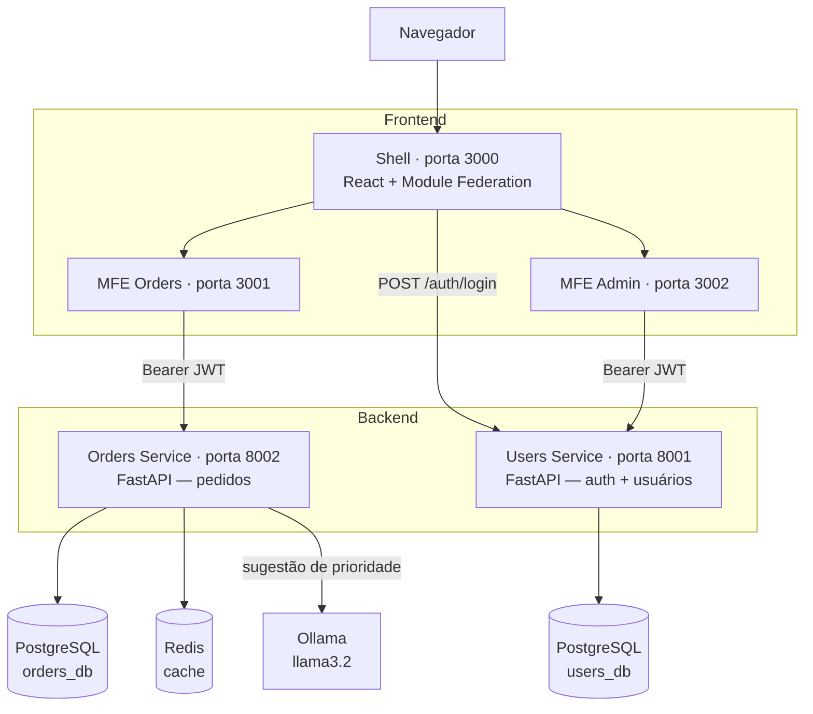

# Plataforma de Gestão de Pedidos — PMV

> Desafio prático — Presidência da República (Edital 173/2026)

## Visão Geral

Plataforma de gestão de pedidos para e-commerce, construída com arquitetura de **microsserviços** no backend e **microfrontends** no frontend.

## Arquitetura

### Diagrama de Serviços




**Fluxo de autenticação:**
1. Frontend faz login no Users Service → recebe JWT + dados do usuário (incluindo `role`)
2. JWT (Json Web Token) é armazenado no localStorage e enviado como `Authorization: Bearer`
3. Orders Service valida o JWT com a mesma chave secreta (shared secret)
4. Users Service exige `role=admin` no JWT para todas as rotas `/users/`
5. Shell aplica `AdminRoute` — rota `/admin/*` redireciona para `/orders` se `role != admin`

## Tecnologias Escolhidas

### FastAPI (ao invés de Django)
- Atende muito bem os requisitos: leve, rápido e direto ao ponto
- Mais parecido com Flask, com o qual já tenho familiaridade
- Geração automática de Swagger UI (`/docs`) sem nenhuma configuração extra

### Webpack Module Federation
- Três MFEs independentes: Shell (host), Orders (pedidos), Admin (gestão de usuários)
- Cada MFE pode subir independentemente sem rebuild do Shell

### Redis como cache
- Cache de listagem de pedidos (TTL de 60s) — reduz load no banco em leituras repetidas
- Invalidado automaticamente ao criar/atualizar pedido
- Falha graciosamente: se Redis estiver down, a API continua funcionando sem cache

### JWT com shared secret + roles
- Um único `JWT_SECRET` compartilhado via env var entre os serviços
- O token carrega `role` (`admin` | `operator`), validado localmente por cada serviço

### Integração com IA via Ollama (Bônus)
- Ao criar um pedido, o Orders Service chama um modelo local via **Ollama** para sugerir prioridade e gerar um resumo
- Funciona opcionalmente: se o Ollama não estiver disponível, usa prioridade `medium` e sem resumo
- Modelo padrão: `llama3.2` — configurável via constante `OLLAMA_MODEL` em `ai_service.py`
- Roda completamente local (sem custo de API, sem dependência de chave externa)

### Cloudflare Tunnel
- Um container `cloudflared` no Compose expõe os serviços publicamente via túnel, sem abrir portas no firewall
- Permite acesso externo à demo em `damaceno.org` sem necessidade de IP fixo ou configuração de DNS manual


## Endpoints da API

### Users Service (porta 8001)
| Método | Endpoint | Auth | Descrição |
|--------|----------|------|-----------|
| POST | `/auth/login` | — | Login — retorna JWT + dados do usuário |
| POST | `/users/` | admin | Criar usuário (com seleção de papel) |
| GET | `/users/` | admin | Listar usuários |
| GET | `/health` | — | Health check |

### Orders Service (porta 8002)
| Método | Endpoint | Auth | Descrição |
|--------|----------|------|-----------|
| GET | `/orders/` | JWT | Listar pedidos (filtro `?status=`) |
| POST | `/orders/` | JWT | Criar pedido (IA sugere prioridade) |
| GET | `/orders/{n}` | JWT | Buscar pedido pelo número |
| PATCH | `/orders/{n}/status` | JWT | Atualizar status |
| GET | `/health` | — | Health check |

### Acesse a aplicação

| Serviço | URL |
|---------|-----|
| Frontend (Shell) | https://damaceno.org |
| Users Service API (docs) | https://api-users.damaceno.org/docs |
| Orders Service API (docs) | https://api-orders.damaceno.org/docs |

**Login admin (criado automaticamente):** `admin@admin.com` / `admin123`

O admin pode acessar `/admin` para visualizar os usuários cadastrados e criar novos com papel `admin` ou `operator`.
Usuários `operator` só têm acesso à área de pedidos (`/orders`), onde podem listar pedidos (com filtro por status), buscar um pedido pelo número, criar novos pedidos e atualizar o status de pedidos existentes.

## Testes

```bash
# Users Service
cd services/users
pip install -r requirements.txt
pytest tests/ -v

# Orders Service
cd services/orders
pip install -r requirements.txt
pytest tests/ -v
```

## CI Pipeline

GitHub Actions configurado em `.github/workflows/`:
- `ci-users.yml` — roda testes do Users Service a cada push em `services/users/`
- `ci-orders.yml` — roda testes do Orders Service a cada push em `services/orders/`
- `ci-frontend.yml` — valida build dos MFEs a cada push em `frontend/`

## O Que Ficaria Diferente com Mais Tempo

- **CRUD completo de usuários e pedidos:** hoje é possível criar, listar e buscar por número — faltam edição e exclusão tanto no backend quanto nos MFEs.
- **Integração mais profunda com IA:** o Ollama hoje só sugere prioridade na criação do pedido. Com mais tempo, exploraria outras possibilidades. conversacional dentro do MFE.
- **Paginação e filtros avançados:** a listagem de pedidos retorna tudo de uma vez; em produção seria necessário paginação e filtros por data, valor e cliente.
- **Refresh token:** o JWT atual expira e força novo login. Implementaria um fluxo de refresh token silencioso.
- **Observabilidade:** implementaria logs e registro de tudo que acontece, tanto em relação à saúde da aplicação, quanto em relação a atividade dos usuários.

### Decisões Não Tomadas (e Por Quê)
- **MongoDB**: optei por Redis por me parecer mais simples e já resolve o caso de cache. Talvez MongoDB fizesse mais sentido se os pedidos tivessem schema muito variável, o que não é o caso aqui.