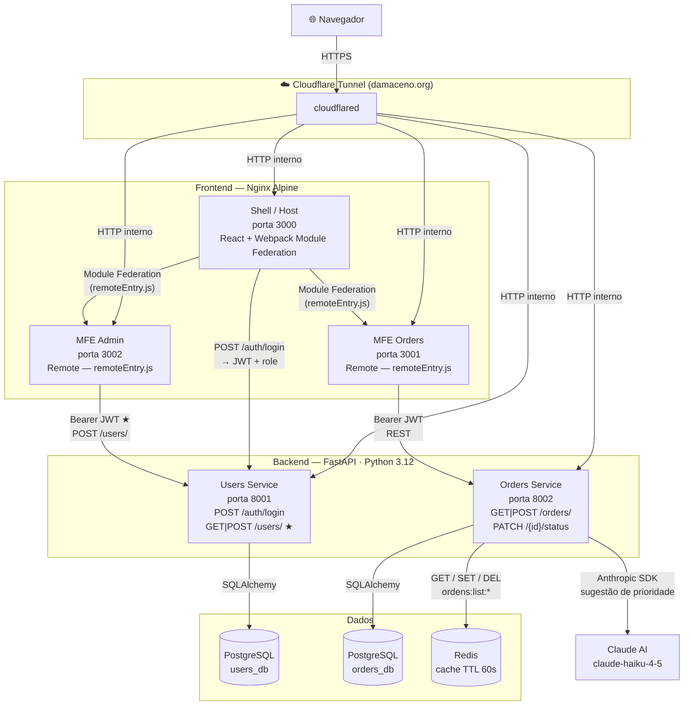
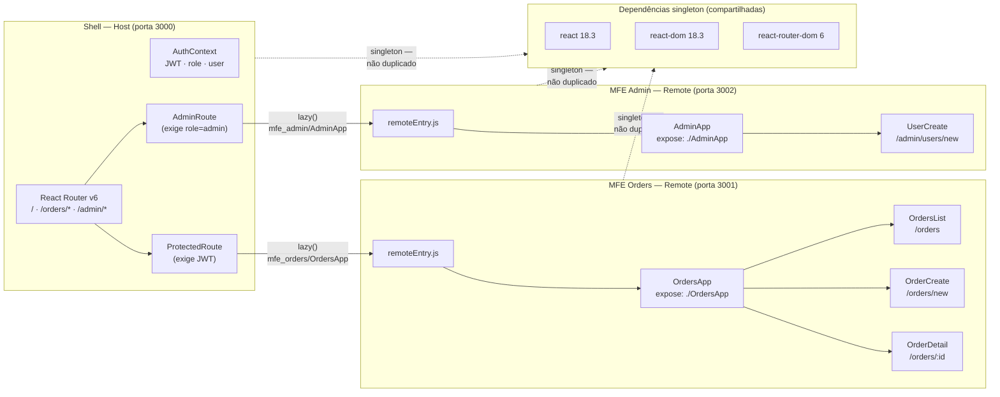

# Plataforma de Gestão de Pedidos — PMV

> Desafio prático — Presidência da República (Edital 173/2026)

## Visão Geral

Plataforma de gestão de pedidos para e-commerce, construída com arquitetura de **microsserviços** no backend e **microfrontends** no frontend.

## Arquitetura

### Diagrama de Serviços



> ★ requer JWT com `role=admin`

---

### Composição dos Microfrontends (Module Federation)



**Fluxo de autenticação:**
1. Frontend faz login no Users Service → recebe JWT + dados do usuário (incluindo `role`)
2. JWT (Json Web Token) é armazenado no localStorage e enviado como `Authorization: Bearer`
3. Orders Service valida o JWT com a mesma chave secreta (shared secret)
4. Users Service exige `role=admin` no JWT para todas as rotas `/users/`
5. Shell aplica `AdminRoute` — rota `/admin/*` redireciona para `/orders` se `role != admin`

## Tecnologias Escolhidas

### FastAPI (não Django REST Framework)
- Atende muito bem os requisitos: leve, rápido e direto ao ponto
- Mais parecido com Flask, com o qual já tenho familiaridade
- Geração automática de Swagger UI (`/docs`) sem nenhuma configuração extra — pontos bônus grátis

### Webpack Module Federation
- Três MFEs independentes: Shell (host), Orders (pedidos), Admin (gestão de usuários)
- Cada MFE pode subir independentemente sem rebuild do Shell

### Redis como cache
- Cache de listagem de pedidos (TTL de 60s) — reduz load no banco em leituras repetidas
- Invalidado automaticamente ao criar/atualizar pedido
- Falha graciosamente: se Redis estiver down, a API continua funcionando sem cache

### JWT com shared secret + roles
- Um único `JWT_SECRET` compartilhado via env var entre os serviços
- O token carrega `role` (`admin` | `operator`), validado localmente por cada serviço
- Alternativa não tomada: JWKS endpoint no Users Service — mais robusto para revogação imediata, mas adiciona latência e complexidade

### Integração com IA via Ollama (Bônus)
- Ao criar um pedido, o Orders Service chama um modelo local via **Ollama** para sugerir prioridade e gerar um resumo
- Funciona opcionalmente: se o Ollama não estiver disponível, usa prioridade `medium` e sem resumo
- Modelo padrão: `llama3.2` — configurável via constante `OLLAMA_MODEL` em `ai_service.py`
- Roda completamente local (sem custo de API, sem dependência de chave externa)

### Cloudflare Tunnel
- Um container `cloudflared` no Compose expõe os serviços publicamente via túnel, sem abrir portas no firewall
- Permite acesso externo à demo em `damaceno.org` sem necessidade de IP fixo ou configuração de DNS manual

## Como Executar

### Pré-requisitos
- Docker e Docker Compose instalados

### 1. Clone e configure
```bash
git clone <repo>
cd desafio_presidencia
cp .env.example .env
```

### 2. Suba a stack
```bash
docker-compose up --build
```

Aguarde todos os serviços iniciarem (~2 minutos no primeiro build).

O Users Service cria automaticamente um usuário admin na primeira inicialização.

### 3. Acesse a aplicação

| Serviço | URL |
|---------|-----|
| Frontend (Shell) | http://localhost:3000 |
| MFE Orders | http://localhost:3001 |
| MFE Admin | http://localhost:3002 |
| Users Service API | http://localhost:8001/docs |
| Orders Service API | http://localhost:8002/docs |

**Login admin (criado automaticamente):** `admin@admin.com` / `admin123`

O admin pode acessar `/admin` para criar novos usuários com papel `admin` ou `operator`.
Usuários `operator` só têm acesso à área de pedidos (`/orders`).

## Endpoints da API

### Users Service (porta 8001)
| Método | Endpoint | Auth | Descrição |
|--------|----------|------|-----------|
| POST | `/auth/login` | — | Login — retorna JWT + dados do usuário |
| POST | `/users/` | admin | Criar usuário (com seleção de papel) |
| GET | `/users/` | admin | Listar usuários |
| GET | `/users/{id}` | admin | Buscar usuário por ID |
| GET | `/health` | — | Health check |

### Orders Service (porta 8002)
| Método | Endpoint | Auth | Descrição |
|--------|----------|------|-----------|
| GET | `/orders/` | — | Listar pedidos (filtro `?status=`) |
| POST | `/orders/` | — | Criar pedido (IA sugere prioridade) |
| GET | `/orders/{id}` | — | Buscar pedido por ID |
| PATCH | `/orders/{id}/status` | JWT | Atualizar status |
| GET | `/health` | — | Health check |

## Testes

```bash
# Users Service
cd services/users
pip install -r requirements.txt
pytest tests/ -v

# Orders Service
cd services/orders
pip install -r requirements.txt
pytest tests/ -v
```

## CI Pipeline

GitHub Actions configurado em `.github/workflows/`:
- `ci-users.yml` — roda testes do Users Service a cada push em `services/users/`
- `ci-orders.yml` — roda testes do Orders Service a cada push em `services/orders/`
- `ci-frontend.yml` — valida build dos MFEs a cada push em `frontend/`

## Demonstração de Resiliência

Para demonstrar que os serviços são independentes:

```bash
# Derrube o Users Service — Orders ainda funciona para leitura
docker-compose stop users-service

# Pedidos continuam sendo listados (e criados sem autenticação)
# Apenas PATCH /status ficará retornando 401 (sem JWT válido)

# Suba novamente
docker-compose start users-service
```

## O Que Ficaria Diferente com Mais Tempo

### Prioridade Alta
1. **API Gateway** (Nginx ou Kong): roteamento centralizado, rate limiting, SSL termination — atualmente o frontend faz chamadas diretas para cada serviço
2. **Refresh token**: o JWT atual expira em 24h mas não há mecanismo de refresh sem re-login
3. **RBAC granular no backend de pedidos**: atualmente qualquer usuário autenticado pode atualizar status de pedido — em produção, certas transições de status (ex: cancelar pedido) poderiam ser restritas a `admin`
4. **Testes de integração**: os testes atuais usam SQLite em memória; idealmente subiriam um PostgreSQL de teste via `pytest-docker`

### Prioridade Média
5. **Comunicação assíncrona**: ao criar um pedido, publicar evento em Redis Pub/Sub ou RabbitMQ — permitiria notificações, auditoria e integração com outros serviços sem acoplamento
6. **MFE Catálogo**: microfrontend para gerenciar o catálogo de produtos, que hoje são strings livres no formulário
7. **Paginação no frontend**: a listagem não tem paginação — em produção com milhares de pedidos isso seria crítico
8. **Observabilidade real**: estrutura de logs está pronta, mas falta integração com Prometheus/Grafana ou Datadog

### Decisões Não Tomadas (e Por Quê)
- **MongoDB**: optei por Redis como complemento ao PostgreSQL — mais simples de justificar operacionalmente para um PMV, e já resolve o caso de cache. MongoDB faria sentido se os pedidos tivessem schema muito variável, o que não é o caso aqui.
- **JWKS / validação remota de token**: mais seguro (permite revogação imediata de tokens), mas adiciona latência na validação de cada request. Para o PMV, shared secret é suficiente.
- **SSR / Next.js**: considerado para o Shell, rejeitado — Module Federation com SSR adiciona complexidade significativa e não é necessário para uma ferramenta interna.

## Estrutura do Projeto

```
desafio_presidencia/
├── services/
│   ├── users/                  # Microsserviço de usuários + JWT
│   │   ├── app/
│   │   │   ├── main.py         # Bootstrap: cria admin inicial se DB vazio
│   │   │   ├── models.py       # SQLAlchemy User model (roles: admin | operator)
│   │   │   ├── schemas.py      # Pydantic schemas
│   │   │   ├── auth.py         # bcrypt + JWT issuer + require_admin guard
│   │   │   ├── config.py       # Settings via pydantic-settings
│   │   │   ├── database.py     # SQLAlchemy engine
│   │   │   └── routes/
│   │   │       ├── auth.py     # POST /auth/login
│   │   │       └── users.py    # CRUD /users (admin only)
│   │   ├── tests/
│   │   ├── Dockerfile
│   │   └── requirements.txt
│   └── orders/                 # Microsserviço de pedidos
│       ├── app/
│       │   ├── main.py
│       │   ├── models.py       # SQLAlchemy Order model
│       │   ├── schemas.py
│       │   ├── auth.py         # JWT validator (shared secret)
│       │   ├── ai_service.py   # Ollama (local LLM) integration
│       │   ├── redis_client.py # Cache layer
│       │   ├── config.py
│       │   ├── database.py
│       │   └── routes/
│       │       └── orders.py   # CRUD + status update
│       ├── tests/
│       ├── Dockerfile
│       └── requirements.txt
├── frontend/
│   ├── shell/                  # MFE Host (Webpack Module Federation)
│   │   ├── src/
│   │   │   ├── App.jsx         # Routing + lazy MFE loading + AdminRoute
│   │   │   ├── context/        # AuthContext (JWT + role state)
│   │   │   └── components/     # Navigation, Login
│   │   ├── webpack.config.js   # Module Federation host config
│   │   └── Dockerfile
│   ├── mfe-orders/             # MFE Remote — pedidos
│   │   ├── src/
│   │   │   ├── OrdersApp.jsx   # Routes: list, create, detail
│   │   │   ├── api.js          # Fetch wrapper com auth headers
│   │   │   └── components/     # OrdersList, OrderCreate, OrderDetail
│   │   ├── webpack.config.js   # Module Federation remote config
│   │   └── Dockerfile
│   └── mfe-admin/              # MFE Remote — administração (admin only)
│       ├── src/
│       │   ├── AdminApp.jsx    # Routes: criar usuário
│       │   ├── api.js          # Fetch wrapper com auth headers
│       │   └── components/     # UserCreate
│       ├── webpack.config.js   # Module Federation remote config
│       └── Dockerfile
├── cloudflared/                # Configuração do túnel Cloudflare
│   └── config.yml
├── .github/
│   └── workflows/              # CI para cada serviço
├── docker-compose.yml
├── .env.example
└── README.md
```
